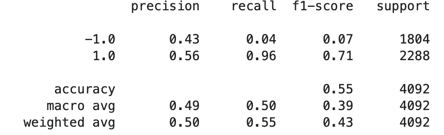
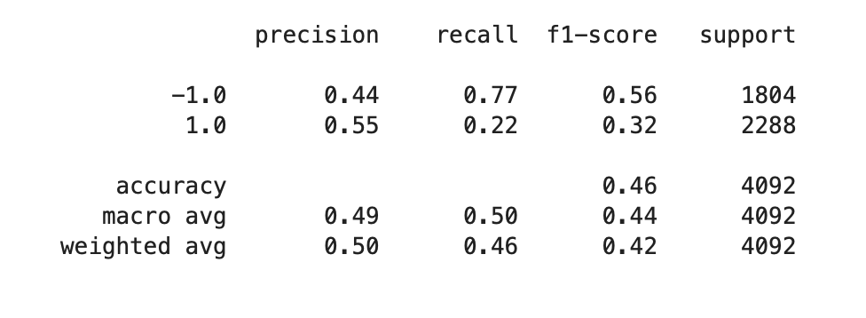
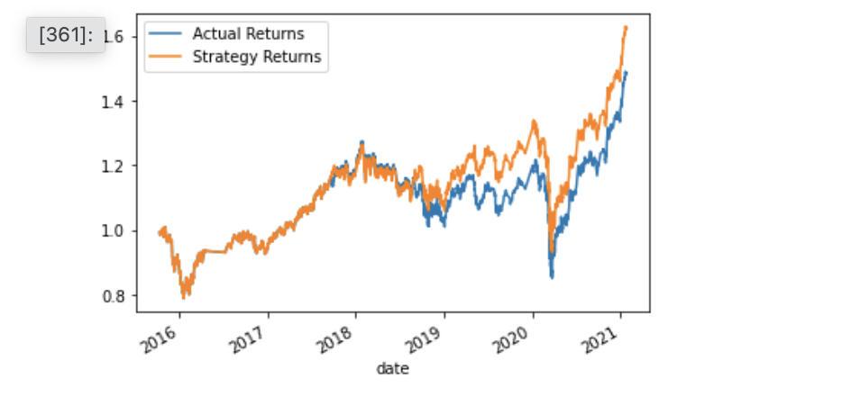

# Algorithmic_tradinng_using_ML
In this repository I suggest the algorithmic trading strategy using Simple Moving Averages (SMA). Then I will train ML models wich will try to predict signals to buy or sell and compare the performance of different models.     

## Results

* Baseline model built using SVM classification tools

* Actual returns vs. the strategy returns

* The DecisionTreeClassifier model classification report with the same parameters

* The best tuned model performance with the DecisionTreeClassifier

* Actual returns vs. the strategy returns

## Summary
Summarizing the results we can tell that the highest accuracy we could get through trying different parameters and alternative model is not much higher than the baseline model's.

## Technologies

JupyterLab web application

This project leverages python 3.7 with the following packages:

* pathlib
* pandas
* hvplot
* pandas.tseries.offsets
* Finta
* and sklearn machine learning library

---

## Usage

To use the "Algorithmic_tradinng_using_ML" clone the repository, open it with Jupyterlab and run the 

    * machine_learning_trading_bot.ipynb

---
    
## Contributor

Nara Arakelyan

---

## Licence 

UC Berkley
    

